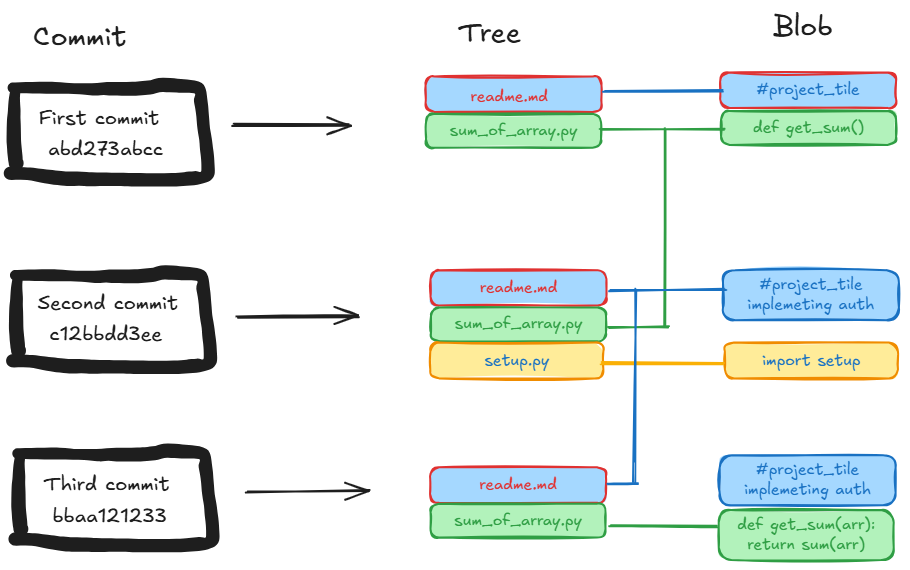

## How does he Git it?

###### Constructing a vantage for Git by examining the components of the software

_This is an intermediate article covering few, but essential components of git._

The very first time I hear the term git it was followed by hub. I visit the GitHub website, create an account, and, after a minute, close the tab. 

After nearly a year, I visit the website again. However, this time I am following a tutorial. I have initialized a local repository, staged the files, established connection to my GitHub account and am ready to push my files. I go through my files again and realize a Jupyter notebook is missing. It was a data preprocessing file I had spent a week coding. I panic. I search the sub directories, parent directory, recycle bin, and even my other drive, but cannot find the notebook. Exhausting all options, I download the old version I previously had sent my professor. I re-code it again and push it to GitHub. My blunder? I had created two local branches from master and did not know git branches control the files you see in the explorer. 

The third time, an older me, is reading a book on git. I learn to differentiate between local git repository and remote git repository. I learn about git branches, and how commits are implemented in git.

In this article, I answer the questions which I had while learning git the third time. I hope this helps solidify the functioning of git.

<details>

<summary><b>Question 1 - 
If git is tracking versions of large code files, will it not consume surmountable memory to store it? Remember how we used to create backup of our work, and at certain time it would fill up our Gmail space? Will git have the same disadvantage?</b></summary>
<br>

- Storing text does not require large amounts of space. One character takes one byte of memory. Assuming, on average, one word takes 6 characters (including the space) 1MB can house roughly 166,600 words. Space required to store the largest novel (In search of lost time) consumes only 8MBs.  Furthermore, text compression techniques are highly efficient and sophisticated. Since code repositories are mainly text, it is not memory intensive for git to track it.

- The other smart move git makes is it only stores the differences. For each file git maintains its base file (the first commit). As you make changes and commit, it stores the differences and discards the similarities as compared to the base file. However, this is a deferred operation. It initially stores complete snapshot of each file, and has a hook which computes and compress the difference(diff).
</details>

<details>
<summary><b>Question 2 - What are the files inside the git directory? What do they store, and what is their role?</b></summary>


Initializing a git repo 

```
$ git init git-visuals
Initialized empty Git repository in /home/shlokkothari/git-visuals/.git/
$ ls -1
HEAD
branches
config
description
hooks
info
objects
refs
```

The initialization creates several files. In this article we will focus on the contents of four files -

<details>
<summary> `.git/HEAD` </summary>
<br>
This stores the reference to the “current branch” of the repository. In my case I am currently on the main branch and so the output is 

```
$ cat .git/HEAD
ref: refs/heads/main
```
When you checkout to a different branch, the HEAD gets updated accordingly
</details>

<details>
<summary> `.git/objects` </summary>
<br>
 This is our storage. All the compressed files are stored here. It is named objects the files are stored as objects. Specifically, a binary large object (blob). Here is a visualization of changes taking place inside this repository for most commonly used commands. 

```
$ cd git-visuals/.git/objects
$ du
4       ./pack
4       ./info
```

Post initialization the objects directory only contains two empty directories. Currently, I do not have any files in my repository and hence this folder is empty. I will add a file containing a function to calculate the sum of all even numbers in an array.

```
$ cat array-sum.py
from typing import List

def sum-of-even-numbers(nums: List[int]) -> int:
    sum_even = 0
    for value in nums:
        if value % 2 == 0:
            sum_even += value
    
    return sum_even
```
Staging the files and observing the changes in objects directory

```
$ git add array-sum.py
$ cd .git/objects
$ du
4       ./pack
4       ./info
8       ./3f
```
A new blob (/3f) is created with the contents of the file. Before I create a commit, I will add another function to add all the odd numbers in the module.

```
$ cat array-sum.py
from typing import List

def sum-of-even-numbers(nums: List[int]) -> int:
    sum_even = 0
    for value in nums:
        if value % 2 == 0:
            sum_even += value

    return sum_even

def sum-of-odd-numbers(nums:List[int]) -> int:
    sum_odd = 0
    for value in nums:
        if value % 2 != 0:
            sum_odd += value

    return value
```

Staging the file again

```
$ git add array-sum.py
$ cd .git/objects
$ du
4       ./pack
4       ./info
8       ./21
8       ./3f
```

Git creates another blob (21). For each time we stage the files, git takes a snapshot of it, even if they are the same files. 

Committing the files

```
$ git commit -m "add array-sum.py"
[main (root-commit) e34a0c4] add array-sum.py
 1 file changed, 17 insertions(+)
 create mode 100644 array-sum.py
$ cd .git/objects
$ du
4       ./pack
8       ./39
8       ./e3
4       ./info
8       ./21
8       ./3f
```
There are multiple blobs created. However, the two blobs previously created are still present. The git does not pack these files until a garbage collector is ran or the files are pushed to a remote repository. I will manually run the garbage collector command and observe the changes

```
$ git gc
Enumerating objects: 3, done.
Counting objects: 100% (3/3), done.
Delta compression using up to 20 threads
Compressing objects: 100% (2/2), done.
Writing objects: 100% (3/3), done.
Total 3 (delta 0), reused 0 (delta 0), pack-reused 0
$ cd .git/objects
$ du
12      ./pack
12      ./info
8       ./3f
```

The files, as expected, have been packed into one file (3f)!

<details>
<summary> `.git/refs` </summary>
<br>
The is pointers book. Analogous to an address book.  This storage therefore helps git navigate efficiently. At initialization this is how it appears.
```
$ cd .git/refs
$ du
4       ./tags
4       ./heads
```

* `/.git/refs/heads` - Each branch has a reference stored inside this directory. The file points to the latest commit on the branch
* `/.git/refs/tags` - Each tag has a reference stored here as well
* `/.git/refs/remote` - Currently, I do not have the local repository connected to a remote repository, however if there were,  a reference would be stored here.

This directory can have several custom sub directories and does not follow a protocol.

If you have an intuition for Graphs, git implements a Directed Acyclic Graph (DAG) of the commits.  The reference directory stores specific entry points to the DAG which helps in efficient graph traversal.
</details>

<details>
<summary> `.git/logs ` <summary>
<br>
As you might have noticed, this directory is not created at initialization. It is instantiated when the first commit is made. This is like a journal of our project. Here is how it is structured
```
.git/logs/
├── HEAD                 # History of HEAD movements
└── refs/
    ├── heads/main       # History of the `main` branch
    ├── heads/feature    # History of the `feature` branch
    └── remotes/origin/main  # History of remote `origin/main
```
Each time a reference is changed it is made note of here. For example, if you move to a different branch, git will log the change. 

Each line in a log file contains

* The <b>old SHA-1 hash</b> (where the reference pointed before).
* The <b>new SHA-1 hash</b> (where the reference points now).

This helps in reversion or glimpsing at the history

</details>

</details>

<details>
<summary><b>Question 3
How can I visualize the commits?</b><summary>
 
 

- Each commit is represented by its hash value

- For each commit blob is created for the files

- If there are no changes to the file from previous commit, git simply points to the previous commit for that file
</details>

A scenario that bothered me

<b>If I do not need a file anymore and I delete it how will git handle this? It will be inefficient for git to keep a track of it or even store the previous versions of it.
</b>

Git commits are immutable. I cannot visit the previous commits and modify them to delete the corresponding blob. However moving forward, git will stop tracking this file, and as commits grow, git’s garbage collector will handle the clean up. 

Insight - Until there is a reference to a file in any commit git will track it. 

That is all from my curiosity on `git`. See you later!